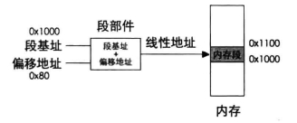
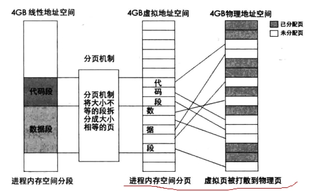
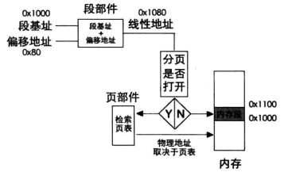
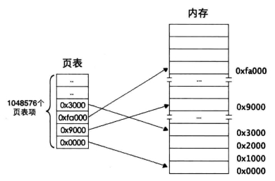
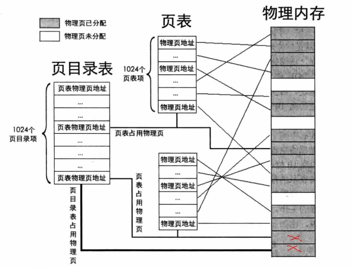
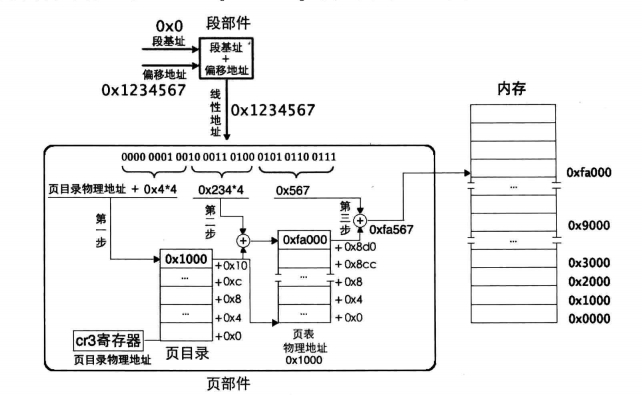
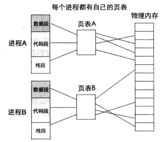
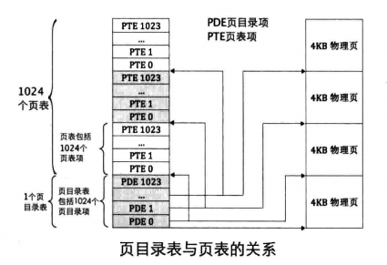
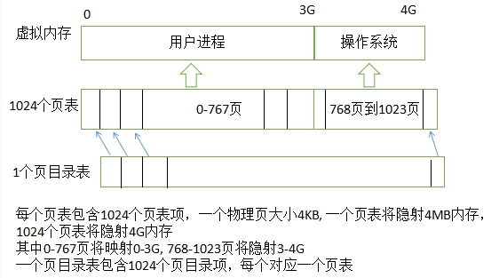
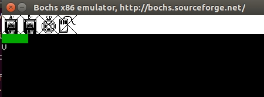

# 段、页式

## 分段的缺陷

* 内存分段机制下的地址访问



原先的程序是直接访问物理地址的，采用虚拟地址和分段机制下：

* 解决了1：进程地址空间不能隔离

每个程序有自己的虚拟地址，虚拟地址是可以相同的，但是会映射到不同物理地址中。确保了**每个程序有独立的虚拟地址空间**

* 解决了2：程序地址重定位的问题

原来直接访问物理地址的情况下，程序每次需要运行时，都需要在内存中分配一块足够大的空闲区域，而问题是这个空闲的位置是不能确定的（空闲的物理内存块不是确定的），这会带来一些重定位的问题，重定位的问题确定就是程序中引用的变量和函数的地址。

分段后每个程序由自己独立的虚拟地址空间(虚拟地址会映射到相应的可分配的物理内存)，程序无需关心物理内存，只需要根据虚拟地址空间来放置变量，代码，不需要重新定位。

<font color='red'>但是分段机制仍有不足</font>

内存映射仍然是以程序为单位，当内存不足是时仍然需要将整个程序交换到磁盘，内存的使用效率依然很低。

即当某个进程需要一块比较大的内存空间是，若物理地址没有连续的这么一块（即便其有很多块较小的，加起来也很大），在分段机制下，该进程是无法运行的。

## 分页

### 分页机制本质和内存映射



当某个进程需要一块比较大的内存空间是，若物理地址没有连续的这么一块（即便其有很多块较小的，加起来也很大），在分段机制下，该进程仍然无法运行。而分页机制，把物理内存映射到不同页中，分页机制提供虚拟的连续内存空间给那个进程，物理上可以达到不连续的效果。

分页机制本质：<font color='red'>将大小不同的大内存段拆分成大小相等的小内存块，可以提供虚拟的连续内存空间，映射到可以不连续到物理内存，让进程能够运行在不连续到物理空间</font>

分段是基础，段页式的内存地址映射



### 分页问题与解决，地址如何映射

#### 页大小

<font color='red'>若一页1字节，那么4G内存空间要有4G个页，一个页要表示32位地址需要4B,页表存放在内存中，那么存放页表需要4G*4B =16GB大小，显然不合理</font>

4G内存=内存块数量*内存块大小（页数量*页的大小），页大小一般是：`4KB`，那么需要页数量: 4GB / 4KB = 1M（即`1,048,576`个页），页表中需要有1,048,576个页表项，这样存储页表项需要1M*4B=4MB，这是合理的

#### 一级分页，二级分页(页目录，页表)



物理地址则有物理页与之对应，物理页的大小也是4KB；定位到物理页后，给出相应偏移，就能访问到该页中的任意的物理内存了；存储1M的页表，需要1M*4B(页表项32bit)=4M物理存储空间

采用二级存储：一级是目录表，二级是页表

   1. 页目录表个数为1K（1024个目录页表）,这1k个页目录表可以存放到任意的物理内存中，也不需要连续存放；
   2. 每个页表可以指定1k个空间的页（每个页表有1024个页表项，一页4KB）；每个页目录表项可以表示1k * 4k = 4M的内存地址，共1024个页目录表项，则可表示1024 * 4M = 4GB的内存地址
   3. 页目录的存储需要4KB物理内存，一个页表也要4kB物理内存



页目录表和页表都将存放到内存中

#### 段页式的地址映射

* 线性地址，分段得到的地址，再到页表中找到对应的页表项，再到物理地址，映射过程（二级分页）




1. 虚拟地址高10位*4，作为页目录表内的偏移地址，加上目录表的物理地址(CR3寄存器含有页目录表基地址)，就能得到页目录的物理地址。读取页目录表的内容，可以得到页表的物理地址

2. 虚拟地址的中间10位*4，作为页表内的偏移地址，加上步骤1的页表物理地址，将得到页表项的物理地址。读取该页表项的内容，可以得到分配的物理页的地址。

3. 虚拟地址高10位和中间10位分别是PED和PTD的索引值，所以需要乘以4。低12位不是索引值，其范围是0-0xfff,作为页内偏移。步骤2的物理地址加上此偏移，得到最终的物理地址。

* 每个进程都将用户自己的页表，都有4G的虚拟内存空间



## 本次分页相关的代码实现


* 页目录表

```java
31-12位 共20位，是物理地址（20位，因为物理页也是4KB）
AVL:可用
G:全局位，TLB高速缓存相关
D:脏页，当cpu对一个页面写操作时，将其设为1
A:访问位，是否被CPU访问过
PCD: Page-level Cache Disable,高速缓存是否禁用
PWT:Page-level Write-Through，页级写通
US:普通用户和超级用户位
RW:读写位
P:是否存在于物理内存中
```

页目录表得基址存于：**页目录基址寄存器PDBR（控制寄存器cr3）**


一个页目录的32位含义比较丰富，这都是为分页机制，分页算法，内存访问相关而设定的，都是有意义的。

同理，**页目录项**可以查阅相关资料，深入阅读。

* 具体实现分页机制，当然**分段**是前提
   1. 实现好页目录表和页表
   2. 页目录表基地址写入控制寄存器cr3
   3. 控制寄存器cr0的PG为设为1，表示分页

### 程序实现

页目录表（1个）和页表（1024个）都存在于物理内存中（需要自行设置物理内存的存储，设计页目录表和页表）

其中页目录表存放了1024个页目录项（每个页目录项32bit=4B）, 页目录表存储需要4KB的物理内存，每个页表有1024个页表项（每个页表项32bit=4B），一个页表也是4KB





虚拟内存4G(0-3G用户进程，3-4G是操作系统)

* 0 到 0x c0 000 000 (3G虚拟地址)（768个页表对应）
* 0xc0 000 000 到 0xff fff fff（1G虚拟地址）（256个页表对应）

物理内存低1MB，刚刚可以分成256页（一页是4KB），所以可用物理内存的低1MB 隐射到虚拟地址的3-4G这1GB为操作系统的虚拟地址，也就是内核占用物理地址的低1MB。所有进程共享内核。

建立页目录，页表; 开启分页;

```java
   ; 创建页目录及页表并初始化页内存位图
   call setup_page

   ;要将描述符表地址及偏移量写入内存gdt_ptr,一会用新地址重新加载
   sgdt [gdt_ptr]	      ; 存储到原来gdt所有的位置

   ;将gdt描述符中视频段描述符中的段基址+0xc0000000
   mov ebx, [gdt_ptr + 2]  
   or dword [ebx + 0x18 + 4], 0xc0000000      ;视频段是第3个段描述符,每个描述符是8字节,故0x18。
					      ;段描述符的高4字节的最高位是段基址的31~24位

   ;将gdt的基址加上0xc0000000使其成为内核所在的高地址
   add dword [gdt_ptr + 2], 0xc0000000

   add esp, 0xc0000000        ; 将栈指针同样映射到内核地址

   ; 把页目录地址赋给cr3
   mov eax, PAGE_DIR_TABLE_POS
   mov cr3, eax

   ; 打开cr0的pg位(第31位)
   mov eax, cr0
   or eax, 0x80000000
   mov cr0, eax

   ;在开启分页后,用gdt新的地址重新加载
   lgdt [gdt_ptr]             ; 重新加载

   mov byte [gs:160], 'V'     ;视频段段基址已经被更新,用字符v表示virtual addr

   jmp $
```


