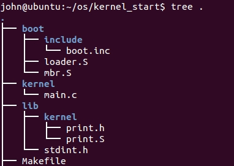
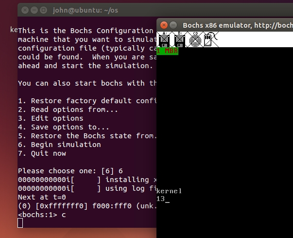
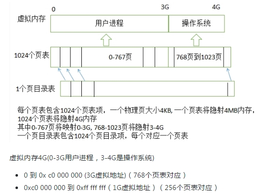
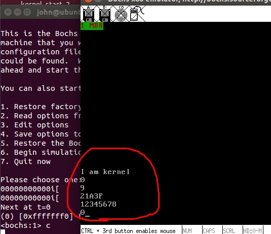

# 开始自己写内核

根据前面的基础，写一个简单的内核：打印字符然后驻留。

《操作系统真相还原》给出了源代码，我力图自己实践理解，确保有代码，也有运行截图（需要注意运行环境）。

我们需要理解磁盘上文件是如何安排的，1M的物理内存如何使用的，4G的虚拟内存如何使用的？

## 程序编码，虚拟机运行

* 代码目录结构



* 注意上述文件的编译运行在32bit的linux环境下,因为要解析ELF文件，需要保持一致（32位和64位的ELF文件格式，有些数据结构大小，字段可能不同，所以解析会不同）

* Makefile

```cpp
.PHONY:build image clean

img=/home/john/os/hd30M.img

mbr_src=mbr.S
loader_src=loader.S

mbr=mbr.bin
loader=loader.bin

mbr_loader:
	nasm -I boot/include/ -o boot/${mbr} boot/${mbr_src}
	nasm -I boot/include/ -o boot/${loader} boot/${loader_src}

build:
	nasm -f elf -o lib/kernel/print.o lib/kernel/print.S
	gcc -I lib/kernel -c -o kernel/main.o  kernel/main.c
	ld -Ttext 0xc0001500 -e main -o kernel/kernel.bin kernel/main.o lib/kernel/print.o

image:
	@-rm -rf $(img)
	bximage -hd -mode="flat" -size=30 -q $(img)
	dd if=./boot/mbr.bin of=$(img) bs=512 count=1 conv=notrunc
	dd if=./boot/loader.bin of=$(img) bs=512 seek=2 count=3 conv=notrunc
	dd if=./kernel/kernel.bin of=$(img) bs=512 seek=9 count=200 conv=notrunc

clean:
	@-rm -rf boot/*.img boot/*.bin boot/*.o /boot/*~
	@-rm -rf lib/*.img lib/*.bin lib/*.o lib/*~
	@-rm -rf lib/kernel/*.img lib/kernel/*.bin lib/kernel/*.o lib/kernel/*~
	@-rm -rf kernel/*.img kernel/*.bin kernel/*.o kernel/*~
	@-rm -rf *.o *.bin *.img *~

```

* main.c（kernel）

```cpp
#include "print.h"
void main(void) {
   put_char('k');
   put_char('e');
   put_char('r');
   put_char('n');
   put_char('e');
   put_char('l');
   put_char('\n');
   put_char('1');
   put_char('2');
   put_char('\b');
   put_char('3');
   while(1);
}
```

其中`\n`表示换行,`\b`表示删除前一字符,最后bochs运行结果图



## 操作系统说明

### 磁盘结构，虚拟地址


### mbr

被加载到物理地址0x7c00，有BIOS读取磁盘的mbr分区（即磁盘的第一个扇区-512字节）

mbr负责读取磁盘2-4扇区的loader内容，加载在物理内存
可用区域，我们选择了0x9000，mbr结束自己，跳转到loader入口地址

### loader

loader建立分段，分页机制等，并读取内核所在的磁盘区域，把内核加载到内存，然后跳转到内核入口处，结束自己

### 内核代码

内核的`kernel.bin`有两个地址，一个是ELF文件地址，这个被加载到物理内存可用区域的0x70000;另一个是解析ELF后的内核映像，这个加载到了0x1500(loader设计的内存大小不超过2000字节，0x9000+2000字节 = 0x1d10，然后空了些，内核选择了0x1500开始后的物理内存）



页表中设置了内核低端1MB的虚拟内存与物理内存一一对应

所以，物理地址0x1500对应到内核虚拟地址就是0xc0001500，这也就是内核入口的虚拟地址（Makefile中编译出kernel.bin就设置的这个地址）

#### 文件加载，内核运行

内核文件目前就是main.o和print.o链接的，print使用汇编写的操作了显存，这样可以将文本输出到屏幕上，main直接调用就行了。

print涉及到光标和单字符的显示，这个是基础的显存操作，后面打印字符串，打印整数可以在此函数上基础上封装。

采用了函数调用方式（参数传递，栈变化，函数执行返回等这些需要理解）

#### 打印函数

* put_str

不断的调用put_char函数，实现打印字符串的功能

```cpp
;--------------------------------------------
;put_str 通过put_char来打印以0字符结尾的字符串
;--------------------------------------------
;输入：栈中参数为打印的字符串
;输出：无

global put_str
put_str:
;由于本函数中只用到了ebx和ecx,只备份这两个寄存器
   push ebx
   push ecx
   xor ecx, ecx		      ; 准备用ecx存储参数,清空
   mov ebx, [esp + 12]	      ; 从栈中得到待打印的字符串地址 
.goon:
   mov cl, [ebx]
   cmp cl, 0		      ; 如果处理到了字符串尾,跳到结束处返回
   jz .str_over
   push ecx		      ; 为put_char函数传递参数
   call put_char
   add esp, 4		      ; 回收参数所占的栈空间
   inc ebx		      ; 使ebx指向下一个字符
   jmp .goon
.str_over:
   pop ecx
   pop ebx
   ret
```

* put_int

put\_int 将数字转成字符，存到一个字符串buffer中，然后put_char
当然并未输出10进制的数，而是打印每个字节内容

* mian.c调用

```cpp
#include "print.h"
void main(void) {
   put_str("I am kernel\n");
   put_int(0);
   put_char('\n');
   put_int(9);
   put_char('\n');
   put_int(0x00021a3f);
   put_char('\n');
   put_int(0x12345678);
   put_char('\n');
   put_int(0x00000000);
   while(1);
}
```

* 结果图


