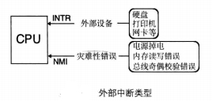
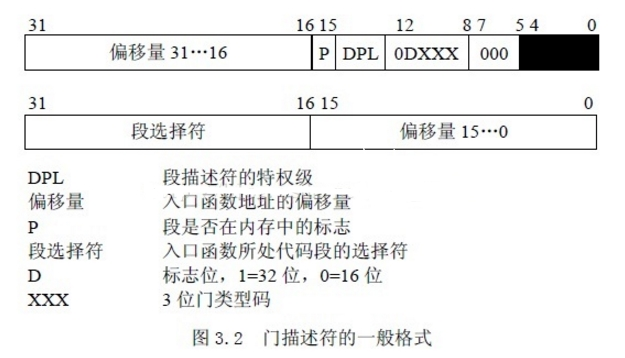
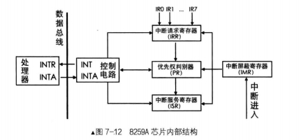
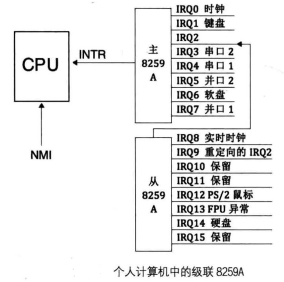
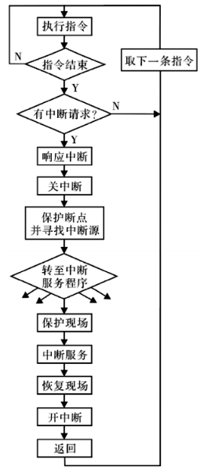

# 中断

* 中断概念，作用，中断描述符表等相关概念理解。

* 编写中断处理程序

## 采用中断系统的主要目的

来自百度百科

1. 提高计算机系统效率。计算机系统中处理机的工作速度远高于外围设备的工作速度。通过中断可以协调它们之间的工作。当外围设备需要与处理机交换信息时，由外围设备向处理机发出中断请求，处理机及时响应并作相应处理。不交换信息时，处理机和外围设备处于各自独立的并行工作状态。

2. 维持系统可靠正常工作。现代计算机中，程序员不能直接干预和操纵机器，必须通过中断系统向操作系统发出请求，由操作系统来实现人为干预。主存储器中往往有多道程序和各自的存储空间。在程序运行过程中，如出现越界访问，有可能引起程序混乱或相互破坏信息。为避免这类事件的发生，由存储管理部件进行监测，一旦发生越界访问，向处理机发出中断请求，处理机立即采取保护措施。

3. 满足实时处理要求。在实时系统中，各种监测和控制装置随机地向处理机发出中断请求，处理机随时响应并进行处理。

4. 提供故障现场处理手段。处理机中设有各种故障检测和错误诊断的部件，一旦发现故障或错误，立即发出中断请求，进行故障现场记录和隔离，为进一步处理提供必要的依据。

## 中断分类

cpu工作是**串行**的，所有任务，包括中断处理都是一个接着一个在cpu中运行的，共享CPU,CPU在各个任务不断切换实现并发。

"操作系统是中断驱动的"，按中断源分为：内部中断和外部中断

### 内部中断

来自CPU内部，如内存读写错误，程序运行错误；按是否正常可分为软中断和异常

* 软中断

由软件主动发起的中断，不是客观的内部错误

* 异常

是在指令执行过程中由于微处理器内部操作发生异常引起的，如硬件失效或非法的系统调用，以及程序员预先设置断点等。

异常按轻重程度分为

1. Fault(故障)，如 page fault(分页异常)，这种异常最轻，可以被恢复

2. Trap(陷阱)

3. Abort(终止)

cpu保护自己，直接终止程序的运行。导致此异常通常是硬件错误，或者某些系统数据结构错误

### 外部中断

由外部设备：网卡，硬盘，打印机等发出的中断

CPU通过指令限制某些设备发出中断请求，称为屏蔽中断。从CPU要不要接收中断即能不能限制某些中断发生的角度 ，中断可分为

* 可屏蔽中断

可被CPU通过指令限制某些设备发出中断请求的中断

* 不可屏蔽中断(non-maskable interrupt，NMI)
不允许屏蔽的中断如电源掉电。

主要用于处理系统的意外或故障，如电源掉电、存储器读/写错误、扩展槽中输入/输出通道错误等。

#### CPU处理外部中断

为了让 CPU 获得每个外部设备的中断信号，最好的方式是在 CPU 中为每一个外设准备一个引脚接收中断，但这是不可能的，计算机中挂了很多外部设备，而且理论上外设数量是没有上限的，无论CPU中准备多少引脚都不够用，况且，我们还嫌CPU的体积太大呢，再整点引脚上去， CPU 岂不是更大了 。

CPU提供两条引线，如下图（INTR和NMI两条）

所有外部中断都走这其中的一条引线，INTR处理可屏蔽的中断，CPU可以随时处理，也可以不处理，他并不影响CPU的运行；NMI处理不可屏蔽的中断，这些中断全是硬伤，cpu都没有必要运行下去了，直接回宕机。

## 中断描述符表

类似段表，页表，保护模式下中断处理程序采用中断描述符表，中断描述符表存放中断处理程序的入口，其中中断描述符也称为门（又可分为陷阱门，调用门，任务门等等）

实模式下存储中断处理程序的入口地址的表叫做中断向量表（Interrupt Vetor Table, LVT）

内核初始化时，初始化可编程控制器8259A；将中断向量IDT 表的起始地址装入IDTR 寄存器，并初始化表中的每一项。

用户进程可以通过**INT指令**发出一个中断请求，其中断请求向量在0～255 之间。为了防止用户使用INT 指令模拟非法的中断和异常，必须对IDT 表进行谨慎的初始化。其措施之一就是将中断门或陷阱门中的DPL 域置为0。如果用户进程确实发出了这样一个中断请求，CPU 会检查出其CPL（3）与DPL（0）有冲突，因此产生一个“通用保护”异常。

但是，有时候必须让用户进程能够使用内核所提供的功能（比如系统调用），也就是说从用户空间进入内核空间，这可以通过把中断门或陷阱门的DPL 域置为3 来达到。

## 利用Intel 8259A芯片实现一个中断处理程序

可编程中断控制器8259A 的作用是负责所有来自外设的中断，其中就包括来自时钟的中断，可以通过它完成进程调度。

8259A的信号和寄存器

* INT: 8259A 选出优先级最高的中断请求后，发信号通知 CPU。

* INTA: INT Acknowledge，中断响应信号 。 位于 8259A 中的 INTA 接收来自 CPU 的剧τA 接口的中断响应信号。

* IMR: Interrupt Mask Register，中断屏蔽寄存器，宽度是 8 位，用来屏蔽某个外设的中断 。

* IRR: Interrupt Request Register，中断请求寄存器，宽度是 8 位。它的作用是接受经过 IMR 寄存器过滤后的中断信号并锁存，此寄存器中全是等待处理的中断，“相当于” 5259A 维护的未处理中断信号队列 。

* PR: Priority Resolver，优先级仲裁器 。 当有多个中断同时发生，或当有新的中断请求进来时，将它与当前正在处理的中断进行比较，找出优先级更高的中断。

* ISR: In-Servi臼 Register，中断服务寄存器，宽度是 8 位。当某个中断正在被处理时，保存在此寄存器中 。

中断处理框架

* 1. 构造好`IDT`(Interrupt Descriptor Table)

中断描述符表（ Interrupt Descriptor Table, IDT），是保护模式下用于存储中断处理程序入口的表，当CPU 接收一个中断时，需要中断向量在此表中检索对应的描述符，在该描述符中找到中断处理程序的起始地址，然后执行中断处理程序。

* 2. 提供中断向量号

外部设备不知道中断向量号这回事，它只负责发中断信号，中断向量号是 8259A 传送给 CPU 的

自己为外部设备设置好，中断向量号，然后自己在中断描述符表中的对应项添加好合适的中断处理程序。

中断处理流程图

## 时钟

在计算机系统中也一样，为了使所有设备之间的通信井然有序，各通信设备间必须有统一的节奏，不能各干各的，这个节奏就称为定时或时钟

时钟只是一种时间的度量，只是一种节奏，其时间长度并不统一，各种设备都有自己的时钟，也就是说都有自己的工作节拍，比如处理器的时钟和外部设备的时钟肯定不是一个数量级，让处理器这种高速设备以外部设备低速时钟工作，处理器肯定会觉得很闲。而让低速的外部设备以处理器的时钟节拍工作，外部设备也许会急得不知所措，完全跟不上节奏。

计算机中的时钟，大致上可分为两大类：内部时钟和外部时钟。

* 内部时钟

内部时钟是指处理器中内部元件，如运算器、控制器的工作时序，主要用于控制、同步内部工作过程的步调。内部时钟是由晶体振荡器产生的，简称晶振，它位于主板上，其频率经过分频之后就是主板的外频，处理器和南北桥之间的通信就基于外频。Intel 处理器将此外频乘以某个倍数（也称为倍频）之后便称为主频。处理器取指令、执行指令中所消耗的时钟周期，都是基于主频的。内部时钟是由处理器固件结构决定的，在出厂时就设定好啦，无法改变。处理器内部元件的工作速度是最快的，所以内部时钟的时间单位粒度比较精细，通常都是纳秒（ns）级的。

* 外部时钟

外部时钟是指处理器与外部设备或外部设备之间通信时采用的一种时序，比如 IO 接口和处理器之间在 AID 转换时的工作时序、两个串口设备之间进行数据传输时也要事先同步时钟等。外部设备的速度对于处理器来说就很慢了，所以其时钟的时间单位粒度较大 一般是毫秒(ms)级或秒 (s)级的。

当外部设备与处理器连接，组成了 一个计算机系统后，我们就要考虑处理器与外部设备间同步数据时的时序配合问题，如何保证运行在不同时钟节拍下的设备能够同步通信？

* 硬件定时器

钟表和计数器其实属于同一类物品，时间本质上就是个没有设定目标终止值的计数器，这个计数器每时每刻都在不停地计数，通常这个计数的单位是秒 。所以，时间就是计数，计数也称为定时，它们本质上是一回事。

硬件定时器一般有两种计时的方式
* 正计时：每一次时钟脉冲发生时，将当前计数值加 l ，直到与设定的目标终止值相等时，提示时间已到，典型的例子就是闹钟。
* 倒计时：先设定好计数器的值，每一次时钟脉冲发生时将计数值减 1 ，直到为 0 时提示时间已到，典型的例子就是电风扇的定时。
