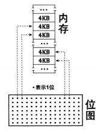
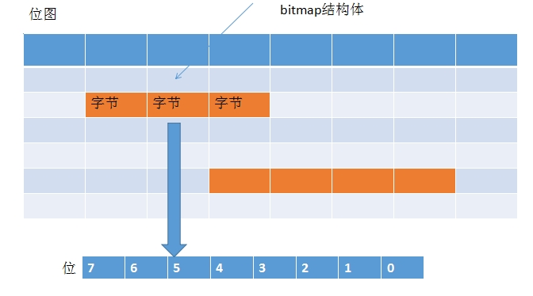
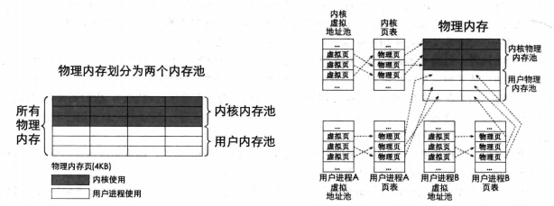
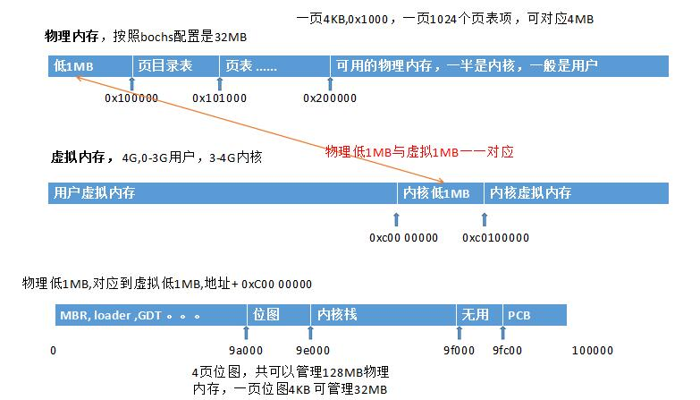
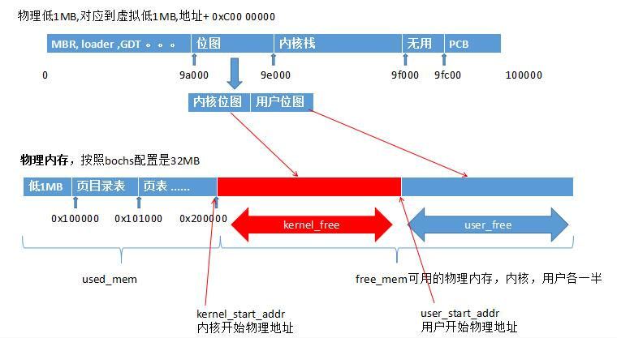
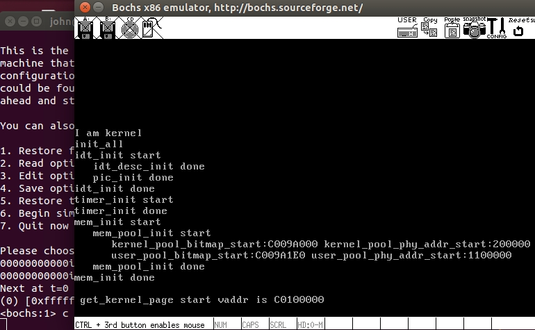
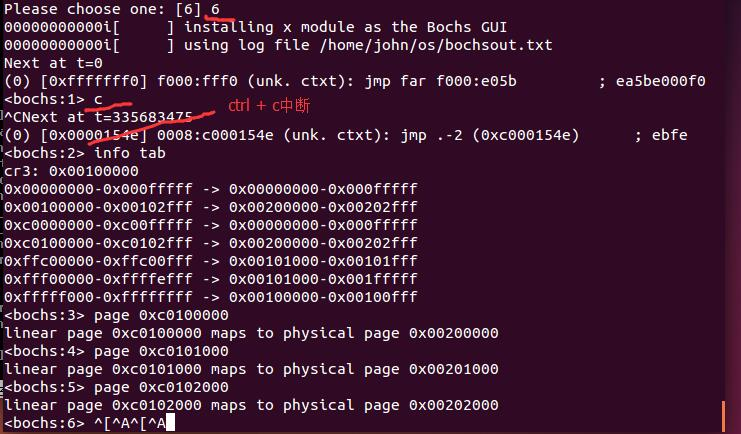

# 内存管理

## 使用位图管理内存



* 1位 对应 一个内存页
* 1位 有两个状态，0 或 1，可以表示有 和 无，如1表示的资源被占用，0表示资源可用

bimap.h

```cpp
#ifndef __LIB_KERNEL_BITMAP_H
#define __LIB_KERNEL_BITMAP_H
#include "global.h"
#define BITMAP_MASK 1
struct bitmap {
   uint32_t btmp_bytes_len;
/* 在遍历位图时,整体上以字节为单位,细节上是以位为单位,所以此处位图的指针必须是单字节 */
   uint8_t* bits;
};

void bitmap_init(struct bitmap* btmp);
bool bitmap_scan_test(struct bitmap* btmp, uint32_t bit_idx);
int bitmap_scan(struct bitmap* btmp, uint32_t cnt);
void bitmap_set(struct bitmap* btmp, uint32_t bit_idx, int8_t value);
#endif
```

* bitmap结构体

```cpp
struct bitmap {
   uint32_t btmp_bytes_len;
/* 在遍历位图时,整体上以字节为单位,细节上是以位为单位,所以此处位图的指针必须是单字节 */
   uint8_t* bits;
};
```

一个字节有8位，每一位都对应一个物理页；bitmap结构体类似一个单链表节点， 每一个位有一个长度，每一个bitmap的地址有上一个链地址给出。

### 位图中申请内存



一个字节的内容只要不是`0xff`就表示该字节里面还有空位, 空位连续代表内存地址连续，即能分配连续内存空间

1. 先逐个字节判断

所有字节都找不到，就失败

2. 某个字节若有空位

在字节里面，逐个位判断，再到空位

3. 取的空位的下标

idx_byte * 8 表示某个字节
再 \+ idx 得到真正的位

判断连续的空位是否满足 cnt 个

```cpp
/* 在位图中申请连续cnt个位,成功则返回其起始位下标，失败返回-1 */
int bitmap_scan(struct bitmap* btmp, uint32_t cnt) {
   uint32_t idx_byte = 0;	 // 用于记录空闲位所在的字节
/* 先逐字节比较,蛮力法 */
   while (( 0xff == btmp->bits[idx_byte]) && (idx_byte < btmp->btmp_bytes_len)) {
/* 1表示该位已分配,所以若为0xff,则表示该字节内已无空闲位,向下一字节继续找 */
      idx_byte++;
   }

   ASSERT(idx_byte < btmp->btmp_bytes_len);
   if (idx_byte == btmp->btmp_bytes_len) {  // 若该内存池找不到可用空间
      return -1;
   }

 /* 若在位图数组范围内的某字节内找到了空闲位，
  * 在该字节内逐位比对,返回空闲位的索引。*/
   int idx_bit = 0;
 /* 和btmp->bits[idx_byte]这个字节逐位对比 */
   while ((uint8_t)(BITMAP_MASK << idx_bit) & btmp->bits[idx_byte]) {
	 idx_bit++;
   }

   int bit_idx_start = idx_byte * 8 + idx_bit;    // 空闲位在位图内的下标
   if (cnt == 1) {
      return bit_idx_start;
   }

   uint32_t bit_left = (btmp->btmp_bytes_len * 8 - bit_idx_start);   // 记录还有多少位可以判断
   uint32_t next_bit = bit_idx_start + 1;
   uint32_t count = 1;	      // 用于记录找到的空闲位的个数

   bit_idx_start = -1;	      // 先将其置为-1,若找不到连续的位就直接返回
   while (bit_left-- > 0) {
      if (!(bitmap_scan_test(btmp, next_bit))) {	 // 若next_bit为0
	 count++;
      } else {
	 count = 0;
      }
      if (count == cnt) {	    // 若找到连续的cnt个空位
	 bit_idx_start = next_bit - cnt + 1;
	 break;
      }
      next_bit++;
   }
   return bit_idx_start;
}
```

## 内存池

**内存池：** 把可用内存集中到一个**池子**中，需要就从中取/不需要就可以放回去。

内核和用户进程最终都是运行在物理内存中的，所以需要规划好物理内存，哪些是运行内核的，哪些运行用户进程的？

这里把物理内存分为两个内存池，一个给用户进程，一个给内核进程； 操作系统必须确保自己有足够的内存运行，否则物理内存不足，机器要挂。

内存池按单位分配内存，一块大小为4KB，也就是每次取 4KB, 8KB，12KB这种以4KB为单位的一块或多块，当然块单位的粒度可以调整。

虚拟地址大小4G，每个进程都拥有4G的虚拟地址空间，所以每个进程都维持一个虚拟地址池。

每个程序的虚拟地址是在链接时分配好了的，需要找空闲的物理内存，映射好，然后程序才能执行



memory.h

```cpp
#ifndef __KERNEL_MEMORY_H
#define __KERNEL_MEMORY_H
#include "stdint.h"
#include "bitmap.h"

/* 用于虚拟地址管理 */
struct virtual_addr {
   struct bitmap vaddr_bitmap; // 虚拟地址用到的位图结构
   uint32_t vaddr_start;       // 虚拟地址起始地址
};

extern struct pool kernel_pool, user_pool;
void mem_init(void);
#endif
```

以页为单位管理虚拟地址的分配情况；虚拟地址也要分配。虽然多个进程可以拥有相同的虚拟地址，但究其原因，是因为这些虚拟地址所对应的物理地址是不同的。但是，在同一个进程内的虚拟地址必然是唯一的，这通常是由链接器为其分配的；进程在运行时可以动态从堆中申请内存，系统为其分配的虚拟地址也属于此进程的虚拟地址空间，也必须要保证虚拟地址的唯一性，所以，用位图来记录虚拟地址的分配情况。

采用位图管理内存，1位对应一页大小4KB；对于bochs设置的32MB的物理内存 ，需要`32M / 4K = 8K bit = 1K字节`，也即位图存储需要1/4页,即1/4页就可以表示32M的物理内存了，本例采用4页来管理物理内存，那么最大可以管理512MB的物理内存。

### 内存分布

我们的操作系统具体的内存情况如下图



1. 物理内存低1M用来存储必要的信息：MBR,loader,GDT,位图，内核栈等等信息
2. 分页所需的页目录表，页表等接着存储到物理内存中
3. 剩下的物理内存才是真正可用的，这些内存要给内核和用户进程用



主要我们的内存都是整页的，所有可能会浪费一些物理内存，内存池取内存也是整页整页的分配的。

看看数据结构

```cpp
/* 内存池标记,用于判断用哪个内存池 */
enum pool_flags {
   PF_KERNEL = 1,    // 内核内存池
   PF_USER = 2	     // 用户内存池
};

/* 用于虚拟地址管理 */
struct virtual_addr {
/* 虚拟地址用到的位图结构，用于记录哪些虚拟地址被占用了。以页为单位。*/
   struct bitmap vaddr_bitmap;
/* 管理的虚拟地址 */
   uint32_t vaddr_start;
};
```

```cpp
/* 内存池结构,生成两个实例用于管理内核内存池和用户内存池 */
struct pool {
   struct bitmap pool_bitmap;	 // 本内存池用到的位图结构,用于管理物理内存
   uint32_t phy_addr_start;	 // 本内存池所管理物理内存的起始地址
   uint32_t pool_size;		 // 本内存池字节容量
};

struct pool kernel_pool, user_pool;      // 生成内核内存池和用户内存池
struct virtual_addr kernel_vaddr;	 // 此结构是用来给内核分配虚拟地址
```

* 功能函数

```cpp
/* 在pf表示的虚拟内存池中申请pg_cnt个虚拟页,
 * 成功则返回虚拟页的起始地址, 失败则返回NULL */
static void* vaddr_get(enum pool_flags pf, uint32_t pg_cnt)


/* 得到虚拟地址vaddr对应的pte指针*/
uint32_t* pte_ptr(uint32_t vaddr)


/* 在m_pool指向的物理内存池中分配1个物理页,
 * 成功则返回页框的物理地址,失败则返回NULL */
static void* palloc(struct pool* m_pool)


/* 页表中添加虚拟地址_vaddr与物理地址_page_phyaddr的映射 */
static void page_table_add(void* _vaddr, void* _page_phyaddr)


/* 分配pg_cnt个页空间,成功则返回起始虚拟地址,失败时返回NULL */
void* malloc_page(enum pool_flags pf, uint32_t pg_cnt) 


/* 从内核物理内存池中申请pg_cnt页内存,成功则返回其虚拟地址,失败则返回NULL */
void* get_kernel_pages(uint32_t pg_cnt)
```

我们的总共内存是采用BIOS中断获取的，内存初始函数如下

```cpp
/* 内存管理部分初始化入口 */
void mem_init() {
   put_str("mem_init start\n");
   uint32_t mem_bytes_total = (*(uint32_t*)(0xb00));
   mem_pool_init(mem_bytes_total);	  // 初始化内存池
   put_str("mem_init done\n");
}

/* 初始化内存池 */
static void mem_pool_init(uint32_t all_mem) {
   put_str("   mem_pool_init start\n");
   uint32_t page_table_size = PG_SIZE * 256;	  // 页表大小= 1页的页目录表+第0和第768个页目录项指向同一个页表+
                                                  // 第769~1022个页目录项共指向254个页表,共256个页框
   uint32_t used_mem = page_table_size + 0x100000;	  // 0x100000为低端1M内存
   uint32_t free_mem = all_mem - used_mem;
   uint16_t all_free_pages = free_mem / PG_SIZE;		  // 1页为4k,不管总内存是不是4k的倍数,
								  // 对于以页为单位的内存分配策略，不足1页的内存不用考虑了。
   uint16_t kernel_free_pages = all_free_pages / 2;
   uint16_t user_free_pages = all_free_pages - kernel_free_pages;

/* 为简化位图操作，余数不处理，坏处是这样做会丢内存。
好处是不用做内存的越界检查,因为位图表示的内存少于实际物理内存*/
   uint32_t kbm_length = kernel_free_pages / 8;			  // Kernel BitMap的长度,位图中的一位表示一页,以字节为单位
   uint32_t ubm_length = user_free_pages / 8;			  // User BitMap的长度.

   uint32_t kp_start = used_mem;				  // Kernel Pool start,内核内存池的起始地址
   uint32_t up_start = kp_start + kernel_free_pages * PG_SIZE;	  // User Pool start,用户内存池的起始地址

   kernel_pool.phy_addr_start = kp_start;
   user_pool.phy_addr_start   = up_start;

   kernel_pool.pool_size = kernel_free_pages * PG_SIZE;
   user_pool.pool_size	 = user_free_pages * PG_SIZE;

   kernel_pool.pool_bitmap.btmp_bytes_len = kbm_length;
   user_pool.pool_bitmap.btmp_bytes_len	  = ubm_length;

/*********    内核内存池和用户内存池位图   ***********
 *   位图是全局的数据，长度不固定。
 *   全局或静态的数组需要在编译时知道其长度，
 *   而我们需要根据总内存大小算出需要多少字节。
 *   所以改为指定一块内存来生成位图.
 *   ************************************************/
// 内核使用的最高地址是0xc009f000,这是主线程的栈地址.(内核的大小预计为70K左右)
// 32M内存占用的位图是2k.内核内存池的位图先定在MEM_BITMAP_BASE(0xc009a000)处.
   kernel_pool.pool_bitmap.bits = (void*)MEM_BITMAP_BASE;
							       
/* 用户内存池的位图紧跟在内核内存池位图之后 */
   user_pool.pool_bitmap.bits = (void*)(MEM_BITMAP_BASE + kbm_length);
   /******************** 输出内存池信息 **********************/
   put_str("      kernel_pool_bitmap_start:");put_int((int)kernel_pool.pool_bitmap.bits);
   put_str(" kernel_pool_phy_addr_start:");put_int(kernel_pool.phy_addr_start);
   put_str("\n");
   put_str("      user_pool_bitmap_start:");put_int((int)user_pool.pool_bitmap.bits);
   put_str(" user_pool_phy_addr_start:");put_int(user_pool.phy_addr_start);
   put_str("\n");

   /* 将位图置0*/
   bitmap_init(&kernel_pool.pool_bitmap);
   bitmap_init(&user_pool.pool_bitmap);

   /* 下面初始化内核虚拟地址的位图,按实际物理内存大小生成数组。*/
   kernel_vaddr.vaddr_bitmap.btmp_bytes_len = kbm_length;      // 用于维护内核堆的虚拟地址,所以要和内核内存池大小一致

  /* 位图的数组指向一块未使用的内存,目前定位在内核内存池和用户内存池之外*/
   kernel_vaddr.vaddr_bitmap.bits = (void*)(MEM_BITMAP_BASE + kbm_length + ubm_length);

   kernel_vaddr.vaddr_start = K_HEAP_START;
   bitmap_init(&kernel_vaddr.vaddr_bitmap);
   put_str("   mem_pool_init done\n");
}
```

### 回顾**虚拟地址到物理地址**的转换

1. 虚拟地址高10位*4，作为页目录表内的偏移地址，加上目录表的物理地址，就能得到页目录的物理地址。读取页目录表的内容，可以得到页表的物理地址

2. 虚拟地址的中间10位*4，作为页表内的偏移地址，加上步骤1的页表物理地址，将得到页表项的物理地址。读取该页表项的内容，可以得到分配的物理页的地址。

3. 虚拟地址高10位和中间10位分别是PED和PTD的索引值，所以需要乘以4。低12位不是索引值，其范围是0-0xfff,作为页内偏移。步骤2的物理地址加上此偏移，得到最终的物理地址。

实际操作也是如此，当分配的内存时一页的整数倍时，可能要新建页目录项，新建页表，当然每次的内存分配，释放，位图结构是跟着改变着，我们就是`user\_pool,kernel\_pool`两个来进行物理内存池的管理

### 运行截图

* 运行



* 调试 查看虚拟地址到物理地址的映射



* 查看bitmap内容


低三位是1，说明申请了3个页，符合预期
